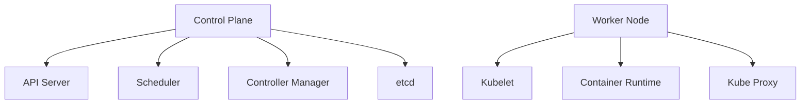
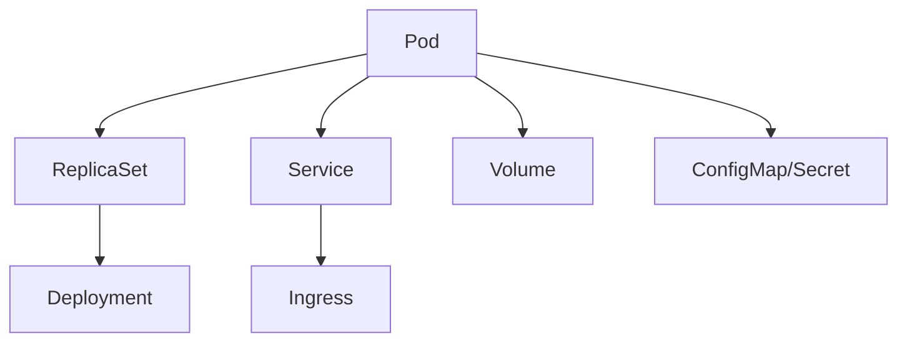

## 1. Kubernetes 简介

Kubernetes（常简称为 k8s）是一个开源的容器编排平台，由 Google 基于其内部使用的 Borg 系统开发。它可以自动化容器部署、扩展和管理，目前已经成为云原生应用的事实标准。

### 1.1 为什么需要 Kubernetes？

在微服务架构盛行的今天，应用程序通常被拆分成多个独立的容器。管理这些容器带来了新的挑战：
- 如何协调和调度这些容器？
- 如何保证高可用性？
- 如何实现自动扩展？
- 如何管理配置和存储？

Kubernetes 正是为解决这些问题而生。

## 2. 核心概念

### 2.1 基础架构



Kubernetes 集群由以下核心组件组成：

1. **Control Plane（控制平面）**
   - API Server：集群的统一入口
   - Scheduler：调度器，决定 Pod 部署位置
   - Controller Manager：维护集群状态
   - etcd：配置数据存储

2. **Worker Node（工作节点）**
   - Kubelet：管理节点上的容器
   - Container Runtime：容器运行时（如 Docker）
   - Kube Proxy：网络代理

### 2.2 基本对象



1. **Pod**：最小部署单元，可包含一个或多个容器
2. **ReplicaSet**：确保预期数量的 Pod 副本在运行
3. **Deployment**：声明式更新 Pod 和 ReplicaSet
4. **Service**：为一组 Pod 提供统一访问入口
5. **Volume**：存储卷
6. **ConfigMap/Secret**：配置管理

## 3. 基本操作

### 3.1 安装与配置

```bash
# 使用 kubeadm 安装 Kubernetes
curl -sfL https://get.k3s.io | sh -

# 查看集群状态
kubectl cluster-info
kubectl get nodes
```

### 3.2 部署应用

```yaml
# deployment.yaml
apiVersion: apps/v1
kind: Deployment
metadata:
  name: nginx-deployment
spec:
  replicas: 3
  selector:
    matchLabels:
      app: nginx
  template:
    metadata:
      labels:
        app: nginx
    spec:
      containers:
      - name: nginx
        image: nginx:1.14.2
        ports:
        - containerPort: 80
```

```bash
# 创建部署
kubectl apply -f deployment.yaml

# 查看部署状态
kubectl get deployments
kubectl get pods
```

## 4. 进阶操作

### 4.1 自动扩展

```yaml
apiVersion: autoscaling/v2
kind: HorizontalPodAutoscaler
metadata:
  name: nginx-hpa
spec:
  scaleTargetRef:
    apiVersion: apps/v1
    kind: Deployment
    name: nginx-deployment
  minReplicas: 1
  maxReplicas: 10
  metrics:
  - type: Resource
    resource:
      name: cpu
      target:
        type: Utilization
        averageUtilization: 50
```

### 4.2 配置管理

```yaml
apiVersion: v1
kind: ConfigMap
metadata:
  name: app-config
data:
  database_url: "mongodb://localhost:27017"
  api_key: "your-api-key"
```

### 4.3 存储管理

```yaml
apiVersion: v1
kind: PersistentVolumeClaim
metadata:
  name: mysql-pvc
spec:
  accessModes:
    - ReadWriteOnce
  resources:
    requests:
      storage: 20Gi
```

## 5. 最佳实践

1. **资源限制**：始终为容器设置资源请求和限制
2. **健康检查**：配置合适的存活和就绪探针
3. **配置管理**：使用 ConfigMap 和 Secret 管理配置
4. **服务发现**：合理使用 Service 和 Ingress
5. **监控告警**：部署监控组件如 Prometheus + Grafana

## 6. 故障排查

常用命令：
```bash
# 查看 Pod 日志
kubectl logs <pod-name>

# 进入 Pod
kubectl exec -it <pod-name> -- /bin/bash

# 查看 Pod 详细信息
kubectl describe pod <pod-name>
```

## 7. 工具生态

1. **Helm**：包管理器
2. **Istio**：服务网格
3. **Prometheus**：监控系统
4. **Grafana**：可视化面板
5. **Kubeadm**：集群管理工具


## Kubernetes 常用命令大全

### 1. 集群管理命令

#### 集群信息
```bash
# 查看集群信息
kubectl cluster-info

# 查看所有节点状态
kubectl get nodes

# 查看节点详细信息
kubectl describe node <node-name>

# 查看集群资源使用情况
kubectl top nodes
```

### 2. Pod 操作命令

#### 基本操作
```bash
# 查看所有 Pod
kubectl get pods -A           # 查看所有命名空间
kubectl get pods             # 查看默认命名空间
kubectl get pods -n <namespace>  # 查看指定命名空间

# 查看 Pod 详细信息
kubectl describe pod <pod-name>

# 查看 Pod 日志
kubectl logs <pod-name>
kubectl logs -f <pod-name>   # 实时查看日志
kubectl logs --tail=100 <pod-name>  # 查看最后100行

# 进入 Pod 容器
kubectl exec -it <pod-name> -- /bin/bash

# 删除 Pod
kubectl delete pod <pod-name>
```

### 3. Deployment 操作命令

#### 部署管理
```bash
# 查看所有部署
kubectl get deployments

# 创建部署
kubectl create deployment <name> --image=<image>

# 应用配置文件
kubectl apply -f <deployment.yaml>

# 修改镜像版本
kubectl set image deployment/<name> <container>=<new-image>

# 查看部署历史
kubectl rollout history deployment/<name>

# 回滚部署
kubectl rollout undo deployment/<name>
kubectl rollout undo deployment/<name> --to-revision=<number>

# 扩缩容
kubectl scale deployment/<name> --replicas=<number>
```

### 4. Service 操作命令

#### 服务管理
```bash
# 查看所有服务
kubectl get services

# 创建服务
kubectl expose deployment <name> --port=<port> --type=NodePort

# 删除服务
kubectl delete service <name>

# 查看服务详情
kubectl describe service <name>
```

### 5. 配置管理命令

#### ConfigMap 和 Secret
```bash
# 查看 ConfigMap
kubectl get configmaps
kubectl describe configmap <name>

# 创建 ConfigMap
kubectl create configmap <name> --from-file=<path>

# 查看 Secret
kubectl get secrets
kubectl describe secret <name>

# 创建 Secret
kubectl create secret generic <name> --from-literal=key=value
```

### 6. 命名空间操作

#### 命名空间管理
```bash
# 查看命名空间
kubectl get namespaces

# 创建命名空间
kubectl create namespace <name>

# 切换默认命名空间
kubectl config set-context --current --namespace=<name>

# 删除命名空间
kubectl delete namespace <name>
```

### 7. 资源监控命令

#### 监控和调试
```bash
# 查看资源使用情况
kubectl top pods
kubectl top nodes

# 查看事件
kubectl get events

# 端口转发
kubectl port-forward <pod-name> <local-port>:<pod-port>

# 查看网络策略
kubectl get networkpolicies
```

### 8. 常用调试命令

#### 故障排查
```bash
# 查看 Pod 状态
kubectl get pods -o wide

# 查看 Pod 详细状态
kubectl describe pod <pod-name>

# 查看容器日志
kubectl logs <pod-name> -c <container-name>

# 复制文件到 Pod
kubectl cp <local-path> <pod-name>:<pod-path>

# 从 Pod 复制文件
kubectl cp <pod-name>:<pod-path> <local-path>
```

### 9. 上下文和配置

#### 集群配置
```bash
# 查看上下文
kubectl config get-contexts

# 切换上下文
kubectl config use-context <context-name>

# 查看当前配置
kubectl config view

# 设置集群参数
kubectl config set-cluster <name>
```

### 10. 常用简写形式

```bash
# 资源类型简写
pods -> po
deployments -> deploy
services -> svc
namespaces -> ns
configmaps -> cm
persistentvolumes -> pv
persistentvolumeclaims -> pvc
```

#### 实用技巧

1. **使用 watch 实时监控**:
```bash
watch kubectl get pods
```

2. **使用标签选择器**:
```bash
kubectl get pods -l app=nginx
```

3. **输出格式化**:
```bash
kubectl get pods -o yaml
kubectl get pods -o json
kubectl get pods -o wide
```

4. **创建资源的简便方法**:
```bash
# 快速生成 YAML 模板
kubectl create deployment nginx --image=nginx --dry-run=client -o yaml
```
