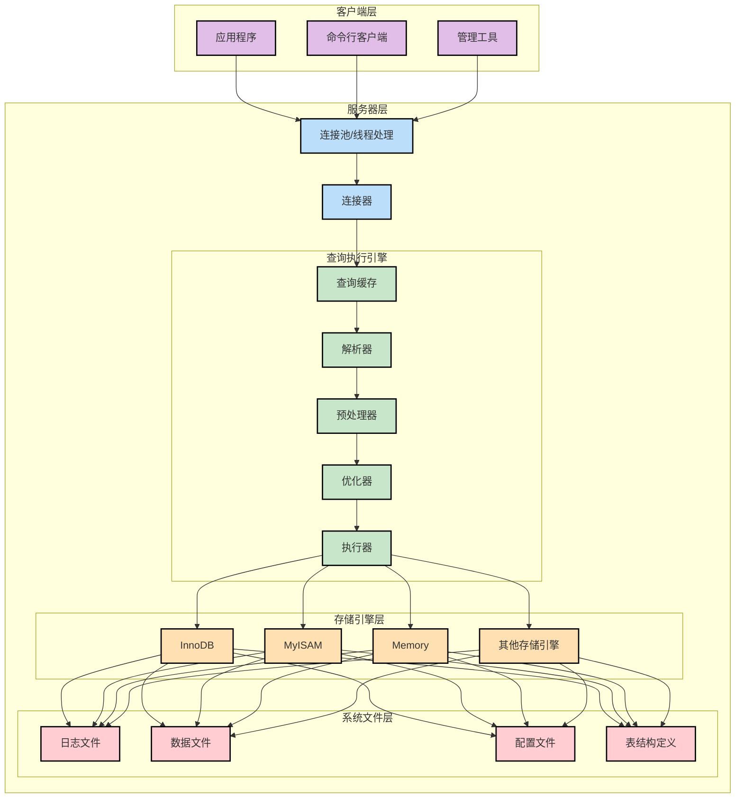
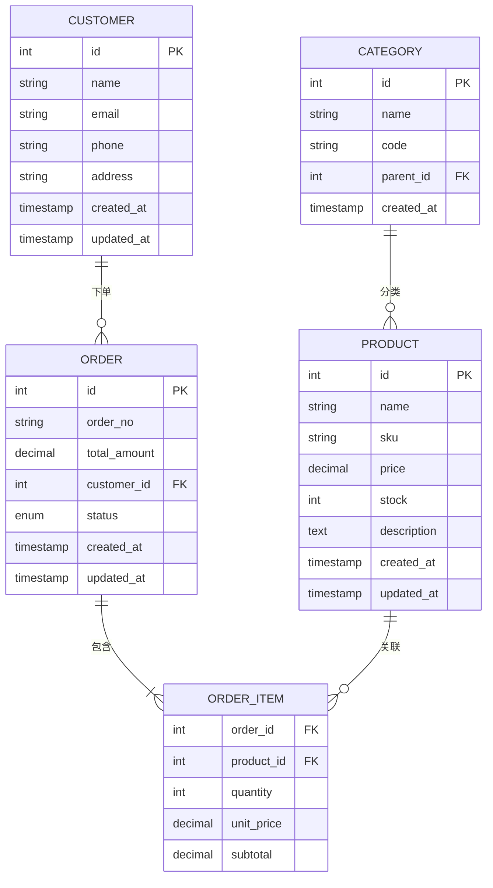
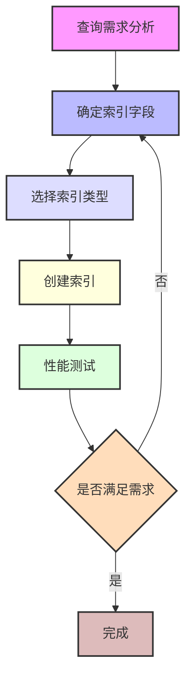
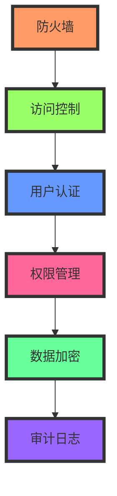
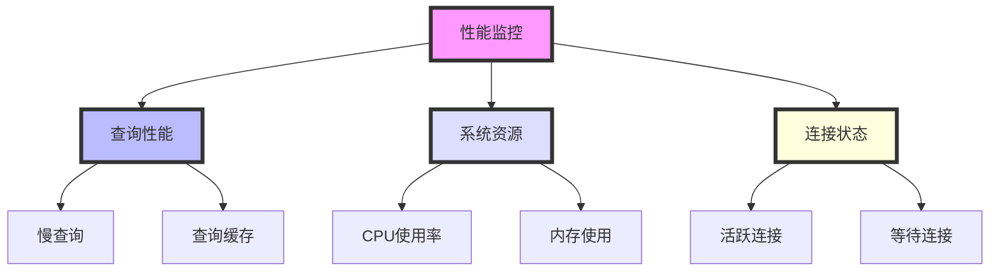

在当今数字化时代的浪潮中，数据库技术早已成为支撑现代应用程序的中流砥柱。而在众多数据库产品中，MySQL无疑是最闪耀的明星之一。作为一位技术爱好者或专业开发者，深入理解MySQL不仅是一种技能的提升，更是打开数据世界大门的金钥匙。让我们踏上这段探索MySQL的奇妙旅程！

## 一、初识MySQL：数据库的明珠

### 1.1 MySQL的前世今生

在数据库的星辰大海中，MySQL犹如一颗璀璨的明珠。它诞生于1995年，由瑞典的MySQL AB公司开发，现已成为Oracle公司的一员。作为开源数据库的翘楚，MySQL以其卓越的性能、可靠的稳定性和零成本的特点，赢得了全球开发者的青睐。

从简单的个人博客到复杂的企业应用，从小型创业公司到科技巨头，MySQL的身影无处不在。Facebook、Twitter、YouTube等互联网巨头都在使用MySQL来支撑其核心业务。这足以证明它的实力和价值。

### 1.2 MySQL的核心架构



这个架构图展示了MySQL的五个主要层次：

1. **客户端层**
   - 应用程序
   - 命令行客户端
   - 管理工具

2. **服务器层**
   - 连接池和线程处理
   - 连接器（权限验证）

3. **查询执行引擎**
   - 查询缓存
   - 解析器（SQL解析）
   - 预处理器
   - 优化器（生成执行计划）
   - 执行器

4. **存储引擎层**
   - InnoDB（支持事务）
   - MyISAM（适合读密集）
   - Memory（内存引擎）
   - 其他存储引擎

5. **系统文件层**
   - 日志文件
   - 数据文件
   - 配置文件
   - 表结构定义文件

每个组件的主要功能：

1. **连接池**：管理和复用数据库连接，减少连接开销
2. **查询缓存**：保存查询结果，提高相同查询的响应速度
3. **解析器**：检查SQL语法，生成解析树
4. **优化器**：生成最优执行计划，选择合适的索引
5. **执行器**：操作存储引擎，返回执行结果
6. **存储引擎**：负责数据的存储和提取


## 二、数据库设计的艺术

### 2.1 数据库设计原则

优秀的数据库设计就像一座精心规划的城市，需要遵循一定的原则：

1. **原子性原则**：字段值不可再分
2. **唯一性原则**：每条记录都是唯一的
3. **关联性原则**：表之间需要通过外键建立合理关联
4. **依赖性原则**：字段之间的依赖关系要合理

让我们通过一个实际的案例来理解这些原则：



### 2.2 存储引擎的选择

MySQL提供了多种存储引擎，就像不同的工具适合不同的场景：

```sql
-- 查看支持的存储引擎
SHOW ENGINES;

-- 创建InnoDB表（适合事务处理）
CREATE TABLE transactions (
    id INT PRIMARY KEY AUTO_INCREMENT,
    amount DECIMAL(10,2),
    created_at TIMESTAMP DEFAULT CURRENT_TIMESTAMP
) ENGINE=InnoDB;

-- 创建MyISAM表（适合读密集场景）
CREATE TABLE logs (
    id INT PRIMARY KEY AUTO_INCREMENT,
    message TEXT,
    created_at TIMESTAMP DEFAULT CURRENT_TIMESTAMP
) ENGINE=MyISAM;
```

## 三、性能优化的智慧

### 3.1 索引优化策略

索引就像图书的目录，好的索引设计能够显著提升查询效率：



### 3.2 查询优化实战

让我们看一些实际的查询优化例子：

```sql
-- 优化前的查询
SELECT p.*, c.name as category_name 
FROM products p 
LEFT JOIN categories c ON p.category_id = c.id 
WHERE p.price > 100 
AND p.created_at > '2024-01-01';

-- 优化后的查询（添加合适的索引）
CREATE INDEX idx_price_created ON products(price, created_at);

-- 使用EXPLAIN分析查询计划
EXPLAIN SELECT p.*, c.name as category_name 
FROM products p 
FORCE INDEX (idx_price_created)
LEFT JOIN categories c ON p.category_id = c.id 
WHERE p.price > 100 
AND p.created_at > '2024-01-01';
```

## 四、事务管理的艺术

### 4.1 ACID特性

MySQL的事务管理遵循ACID原则，就像跳舞需要遵循节奏：


### 4.2 实际应用示例

```sql
-- 开启事务
START TRANSACTION;

-- 转账操作
UPDATE accounts SET balance = balance - 1000 WHERE id = 1;
UPDATE accounts SET balance = balance + 1000 WHERE id = 2;

-- 检查余额是否足够
SELECT @balance := balance FROM accounts WHERE id = 1;
IF @balance >= 0 THEN
    COMMIT;
ELSE
    ROLLBACK;
END IF;
```

## 五、安全防护的堡垒

### 5.1 安全架构

保护数据库安全就像构筑一座坚固的城堡：



### 5.2 安全最佳实践

```sql
-- 创建具有限制权限的用户
CREATE USER 'app_user'@'localhost' 
IDENTIFIED BY 'strong_password';

-- 授予特定权限
GRANT SELECT, INSERT, UPDATE 
ON myapp.* 
TO 'app_user'@'localhost';

-- 启用SSL连接
ALTER USER 'app_user'@'localhost' 
REQUIRE SSL;
```

## 六、备份与恢复的保障

定期备份是数据安全的最后一道防线：

```bash
# 完整备份
mysqldump -u root -p --all-databases > backup.sql

# 增量备份
mysqlbinlog mysql-bin.000001 > incremental.sql

# 还原数据
mysql -u root -p < backup.sql
```

## 七、监控与维护

### 7.1 性能监控



## 八、结语

MySQL是一个深邃而迷人的技术世界，本文虽然已经涵盖了很多内容，但仍然只是沧海一粟。随着技术的不断发展，MySQL也在不断进化，为我们提供更强大的数据管理能力。

希望这篇文章能够为你打开MySQL的大门，让你在数据库的海洋中游刃有余。记住，熟能生巧，只有在实践中不断探索，才能真正掌握MySQL的精髓。

如果你对某个特定主题感兴趣，欢迎在评论区留言，我们一起探讨和深入学习！
