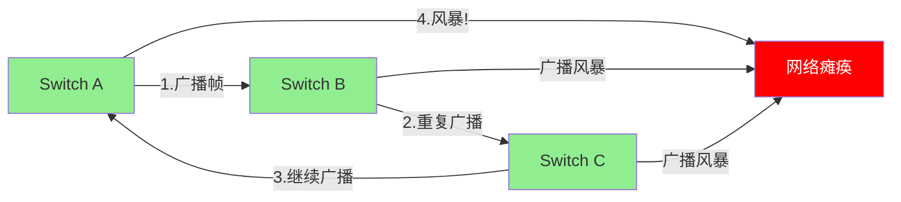
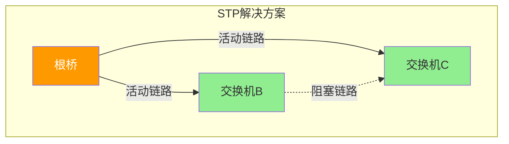
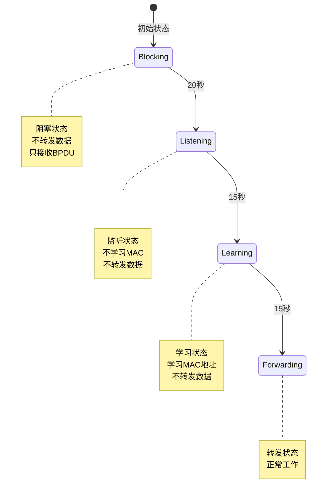
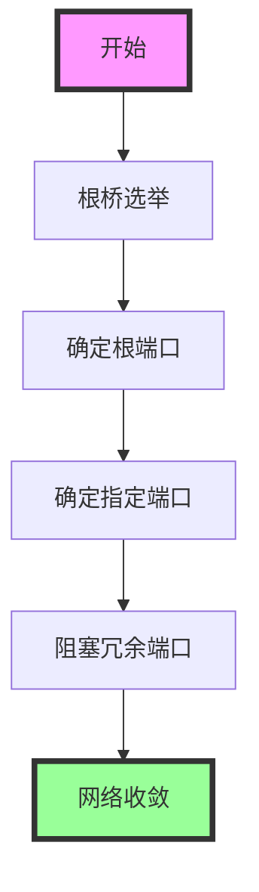
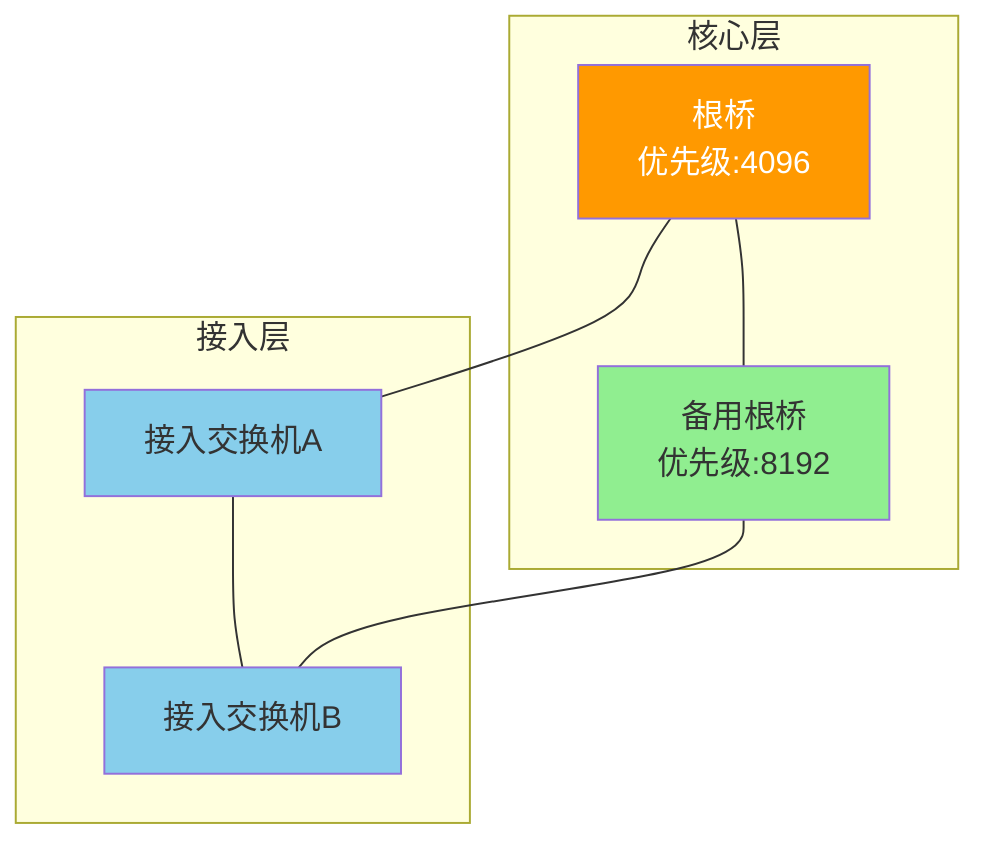
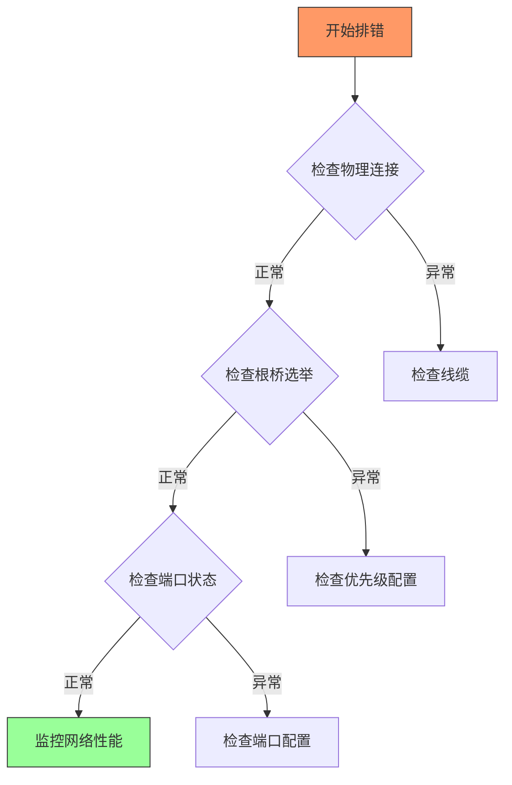
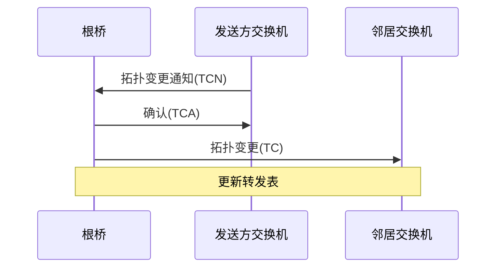
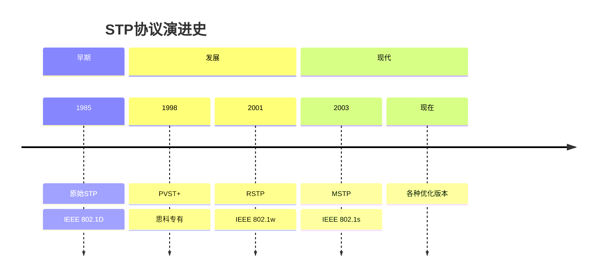

# 深入浅出：生成树协议(STP)完全指南

## 引言
还记得第一次配置交换机时被网络环路折磨的日子吗？数据包在网络中无休止地转发，网络瘫痪，一切陷入混乱。而今天我们要讨论的主角——生成树协议(STP)，正是解决这个问题的"救世主"。让我们开始这段揭秘STP的奇妙旅程吧！




## 为什么需要STP？
在没有STP的网络中，一个简单的广播帧可能引发灾难性的后果：
- 数据帧无限循环
- 网络资源耗尽
- 设备CPU过载
- 网络性能剧烈下降




## STP的工作原理

### 端口状态转换



### 生成树的构建过程



## 实际网络部署示例



## STP配置最佳实践

关键配置命令：
```bash
# 全局启用STP
Switch(config)# spanning-tree mode pvst

# 配置根桥
Switch(config)# spanning-tree vlan 1 priority 4096

# 配置端口开销
Switch(config-if)# spanning-tree cost 100
```

## 故障排除流程图



## 常见问题及解决方案

### 拓扑变更处理流程



## 总结
STP通过巧妙的算法和状态管理，优雅地解决了网络环路问题。虽然它不是完美的（比如收敛时间较长），但它的设计思想值得我们学习。随着网络技术的发展，我们现在有了RSTP、MSTP等更先进的协议，但理解STP的基本原理仍然是网络工程师的必修课。

### 技术演进



你有什么关于STP的经历或疑问吗？欢迎在评论区分享你的想法和经验！
